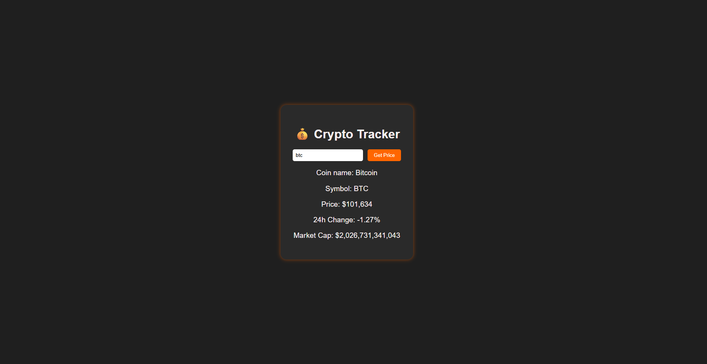

I built a small but fully functional JavaScript web app that retrieves live cryptocurrency data from the CoinGecko API. The user can enter a crypto symbol (like BTC, ETH, SOL), and the app displays:

Coin name

Symbol

Current price (formatted with commas)

24h price change (rounded to 2 decimals)

Market cap (also formatted)

